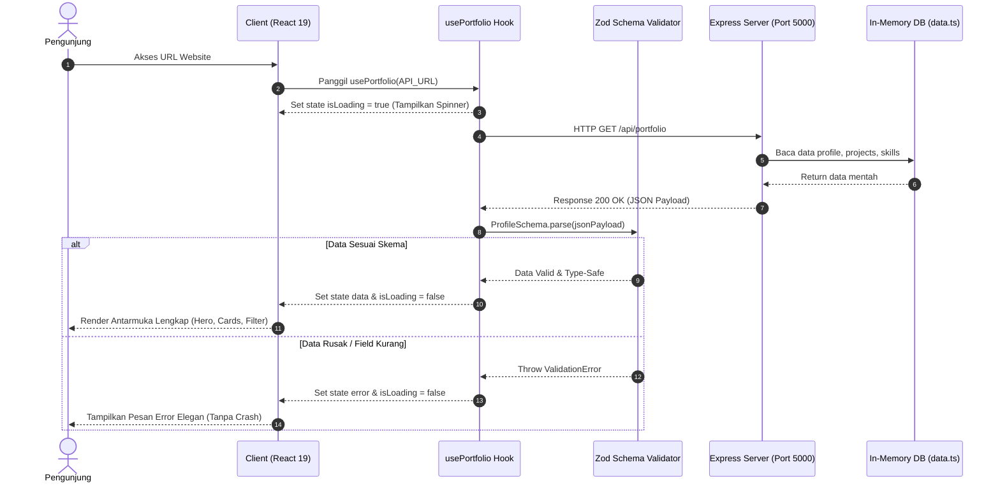

# 📘 DOKUMEN ARSITEKTUR TEKNIS SISTEM
## Decoupled Full Stack Portfolio Platform
**Author:** Geren Haekal Hafizh  
**Repository:** [voiddoiv/GrnHH-Portfolio](https://github.com/voiddoiv/GrnHH-Portfolio)  
**Production URL:** [https://voiddoiv.github.io/GrnHH-Portfolio/](https://voiddoiv.github.io/GrnHH-Portfolio/)

---

## 1. Ringkasan Eksekutif (Executive Summary)
Website ini dibangun menggunakan paradigma **Decoupled Client-Server Architecture** (pemisahan modular antara Presentation Layer dan Data Service Layer). Tujuan arsitektur ini adalah menghasilkan aplikasi portofolio yang dinamis, berkinerja tinggi, aman secara kepatuhan (*NDA compliant*), dan memiliki ketahanan tipe data menyeluruh (**End-to-End Type Safety**) dari backend hingga antarmuka pengguna.

---

## 2. Rincian Teknologi & Pustaka (Tech Stack Breakdown)

### A. Frontend Layer (`/client`)
| Teknologi | Versi | Peran & Alasan Pemilihan |
| :--- | :--- | :--- |
| **React** | 19.x | Library antarmuka berbasis komponen deklaratif, mempermudah reaktivitas state dan modularitas UI. |
| **Vite** | 6.x | Build tool generasi baru bertenaga Native ES Modules. Menawarkan *Hot Module Replacement* (HMR) milidetik dan bundler Rollup teroptimasi. |
| **TypeScript** | 5.x | Bahasa pemrograman utama dengan *strict mode* dan `verbatimModuleSyntax` untuk kompilasi tipe yang efisien. |
| **Zod** | 4.x / 3.x | *Runtime Data Validation*. Memvalidasi skema payload API eksternal sebelum dirender ke layar untuk mencegah *blank-screen crash*. |
| **Modern Native CSS** | Native | Menggunakan CSS Custom Properties (Variables), Glassmorphism (`backdrop-filter`), dan CSS Grid/Flexbox tanpa dependensi library CSS pihak ketiga yang berat. |
| **Lucide Icons & SVG** | 1.x | Set ikon modern berbasis SVG yang ringan dan hemat bundle size. Ditambah komponen native SVG untuk ikon korporat/brand. |

### B. Backend REST API Layer (`/server`)
| Teknologi | Versi | Peran & Alasan Pemilihan |
| :--- | :--- | :--- |
| **Node.js** | 20+ | Runtime JavaScript asinkron berbasis *event-driven* yang efisien untuk I/O operasi HTTP. |
| **Express.js** | 5.x | Framework HTTP server minimalis untuk merancang rute REST API, middleware pipeline, dan response headers. |
| **tsx** | 4.x | TypeScript execute engine berbasis *esbuild* yang memungkinkan eksekusi TypeScript langsung pada Node.js tanpa *pre-compile step*. |
| **CORS** | 2.x | Middleware pengatur kebijakan *Cross-Origin Resource Sharing* agar endpoint aman diakses oleh frontend dari domain berbeda. |
| **Dotenv** | 18.x | Manajemen konfigurasi *Environment Variables* (.env). |

### C. DevOps & Otomasi CI/CD
| Komponen | Peran |
| :--- | :--- |
| **Git & GitHub** | Sistem kontrol versi dengan struktur monorepo terorganisir. |
| **GitHub Actions** | Otomasi deployment pipeline (`.github/workflows/deploy.yml`) yang menjalankan instalasi, build, dan publikasi langsung ke **GitHub Pages**. |

---

## 3. Peta Direktori & Penjelasan Lokasi File (Directory Structure)

```text
GrnHH-Web/
├── .gitignore                          # Filter file agar node_modules & kredensial tidak ter-commit
├── README.md                           # Dokumentasi teknis proyek di GitHub
│
├── .github/
│   └── workflows/
│       └── deploy.yml                  # [CI/CD] Workflow otomatisasi build & deploy ke GitHub Pages
│
├── server/                             # [BACKEND REST API]
│   ├── package.json                    # Konfigurasi dependensi server (Express, CORS, Zod, tsx)
│   ├── tsconfig.json                   # Konfigurasi compiler TypeScript backend (Target ES2022, NodeNext)
│   └── src/
│       ├── index.ts                    # Entry point server Express & pendaftaran REST route
│       ├── db/
│       │   └── data.ts                 # Database in-memory dinamis (penyimpan data biodata, proyek, & skill)
│       └── schemas/
│           └── portfolio.ts            # Skema validasi Zod backend & definisi TypeScript interface
│
└── client/                             # [FRONTEND CLIENT]
    ├── index.html                      # Entry point file HTML web
    ├── vite.config.ts                  # Konfigurasi Vite & base path deployment GitHub Pages
    ├── tsconfig.app.json               # Konfigurasi TypeScript frontend (verbatimModuleSyntax)
    └── src/
        ├── main.tsx                    # Entry point React untuk rendering ke DOM `#root`
        ├── App.tsx                     # Komponen induk: Navbar, Hero, Project Gallery, Filter Tabs, Theme Switcher
        ├── index.css                   # Global design token, tema gelap/terang, utility cards & buttons
        ├── hooks/
        │   └── usePortfolio.ts         # Custom Hook untuk async fetch API + runtime Zod parsing + error handling
        ├── schemas/
        │   └── portfolio.ts            # Mirror skema Zod di frontend untuk menjamin keselarasan kontrak data
        └── components/
            └── Icons.tsx               # Komponen isolasi ikon SVG native (GitHub, LinkedIn)
```

---

## 4. Spesifikasi REST API & Router Server

Server backend berjalan pada port 5000 (lokal) dengan rute terdaftar di `server/src/index.ts`:

| Method | Endpoint | Fungsi | Payload / Response |
| :--- | :--- | :--- | :--- |
| `GET` | `/api/health` | Health check liveness server | `200 OK`: `{"status":"ok", "timestamp":"..."}` |
| `GET` | `/api/portfolio` | Mengambil seluruh data portofolio terstruktur | `200 OK`: Mengembalikan objek data `Profile` lengkap |
| `GET` | `/api/projects` | Mengambil daftar proyek saja | `200 OK`: Mengembalikan array `Project[]` |
| `POST` | `/api/projects` | Menambah proyek baru secara dinamis | Body: JSON Proyek. Validasi Zod -> `201 Created` / `400 Bad Request` |

---

## 5. Alur Kerja Sistem (End-to-End Data Flow)



---

## 6. Penanganan Etika & Kepatuhan Kerahasiaan (NDA & Compliance)
Pada proyek korporat seperti **Enterprise Knowledge Base & Dual-Stream RAG Engine**, arsitektur menerapkan prinsip **Anonymization & Capability-Driven**:
1. **Zero Proprietary Code**: Kode internal bersifat rahasia sehingga repositori tidak dipublikasikan ke publik (`isPrivate: true`).
2. **Entity Anonymization**: Nama produk internal (seperti nama sandi sistem perbankan) dan nama institusi diubah menjadi terminologi rekayasa generik (*Enterprise Compliance Regulations*).
3. **Engineering Focus**: Deskripsi berfokus pada arsitektur teknis yang dirancang (Docling parser batching, BGE-M3 + pgvector dual-stream, HyDE prompt routing, dan RBAC), yang merupakan pembuktian kapabilitas teknis yang sah tanpa membocorkan rahasia bisnis.
